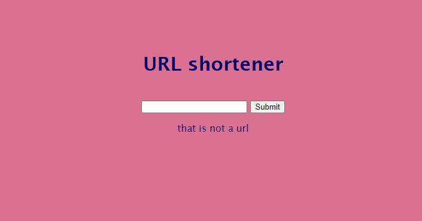

# URL-Shortener

A free, URL shortener service, where you can enter a URL and get a shortened version, for better readability.

## Installation

* Clone or download the repo.
* Open terminal and navigate to `URL-Shortener` folder.
* Run `pipenv shell` to enter virtual environment (or virtual environment of your choice)
* Run `pipenv install` to install dependencies

## Usage
* Run in the pipenv shell terminal `pipenv run dev` or `python server.py` to launch
* Run docker-compose up to run server
* Go to `localhost:5000` to view  
* enter url you want to shorten
* enter the 3 figured code into the url bar e.g. `localhost:5000/Dtg`
* click the link to redirect you to your chosen web page

### Future implementation
- [x] Have link returned take you directly to correct webpage 
- [x] Do the redirection work without middle page
- [x] Add url check to the input
- [x] Make link that appears a clickable button that copy the link
- [x] Deploy in Heroku
